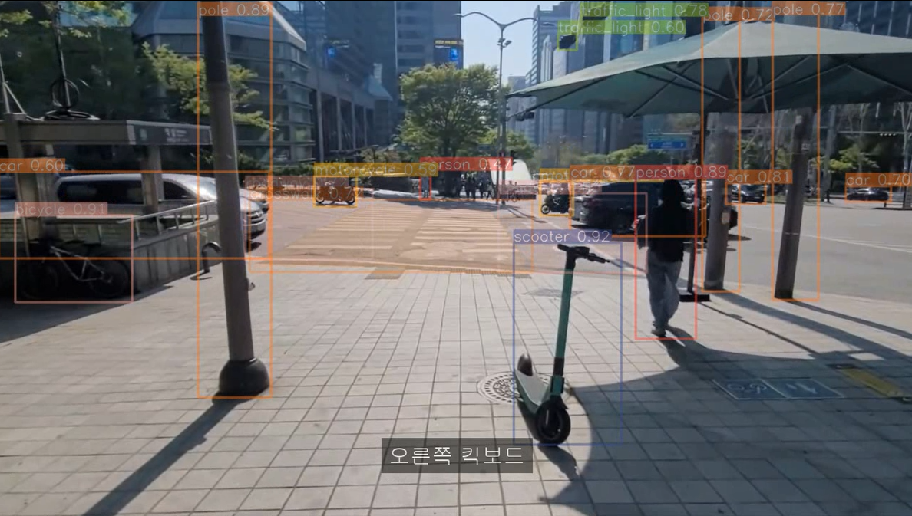
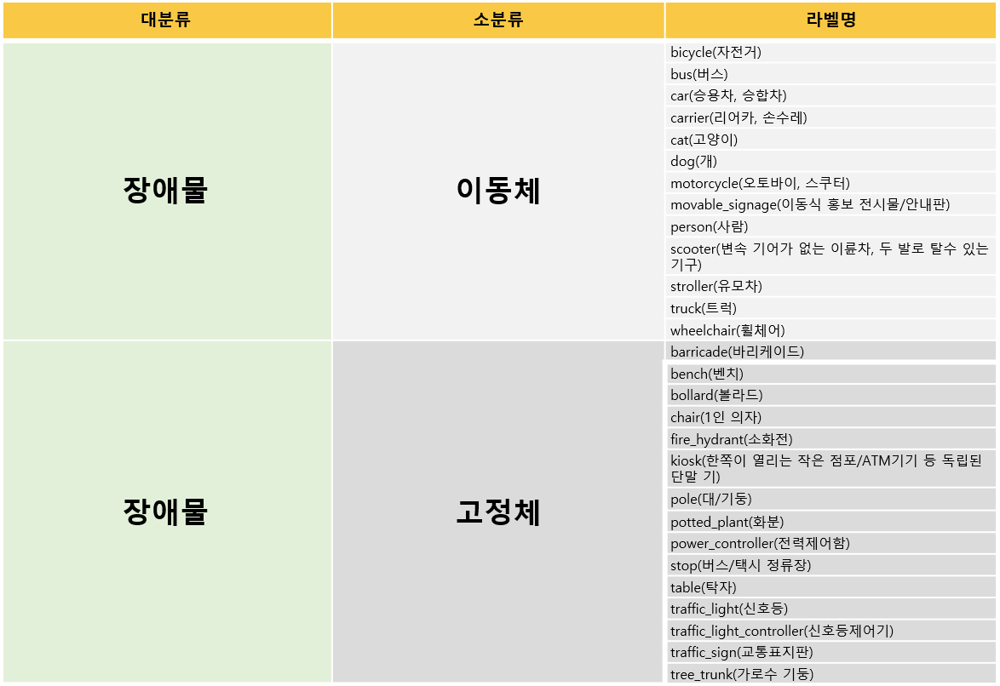
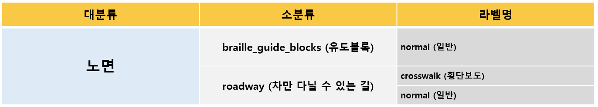
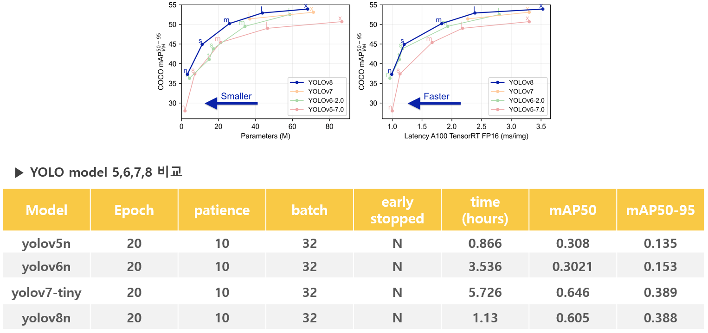
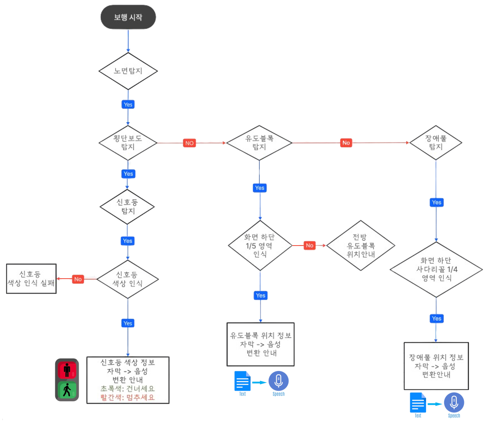
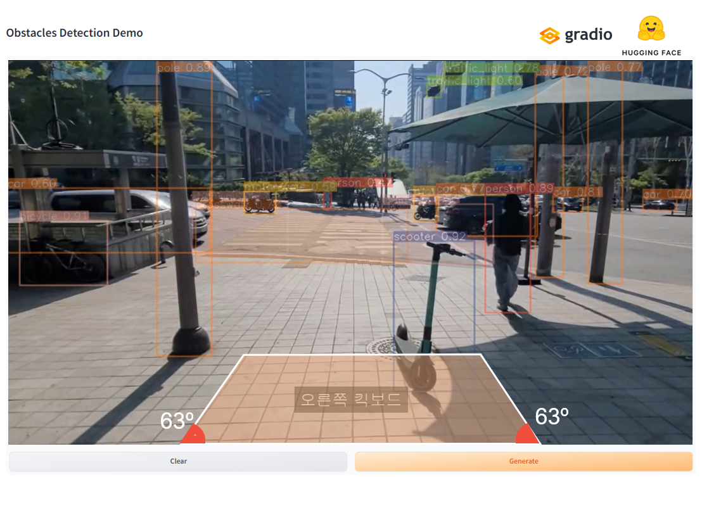

# Block Thru  
### 시각장애인의 안전한 독립보행을 위한 유도 블록 장애물 알림 서비스

 

## 1. 기획의도
#### 2020년 시행된 '한국소비자원'의 조사 결과 유도블록 미설치 및 설치 적정성 미달로 시각장애인들이 유도블록 인식의 어려움을 느끼는 문제점 확인.
#### 오픈 액세스 저널의 '시각장애인의 독립보행 경험에 대한 질적 연구' 자료 확인 결과 실제로 시각 장애인들은 보행에 어려움과 보행 중 다양한 위험에 노출되어있다는 문제점을 확인.
#### 2020년 이후 전동 킥보드의 대중화로 시각 장애인의 보행 방해 현상 심화되었으나, 2022년 서울시에서 발표한 '전동 킥보드 견인 현황'과 리얼 서치 코리아에서 발표한 '전동 킥보드 주차위반 목격 경험' 자료 결과 문제가 해결되지 않음.
#### 위와 같은 이유들로 시각 장애인의 안전한 보행이 보장되지 않는 다는 점을 문제점으로 삼았고, 이를 해결하기 위해 시각장애인들의 안전한 보행을 위한 프로젝트를 시작 함.  
 

## 2. 시장조사
### 프로젝트 시작에 앞서 시장 조사 결과 '시각 장애인용 사물 인식 정보 서비스'와 '길 안내 서비스'가 있다는 것을 확인.
#### 사물 인식 정보 서비스 : 사용자가 원하는 정보에 대한 물체를 찾아서 스마트폰 카메라를 통해 인식을 해야 정보를 얻을 수 있다는 점과 이로 인해 실시간으로 여러 정보를 얻기에는 부적합.
#### 길 안내 서비스 : 해외 기반으로 국내에서 사용이 어렵다는 점과 GPS기반으로 길 안내 서비스는 가능 하지만 실시간 장애물 안내가 되지 않는 점. 
#### 따라서, 기존의 서비스와는 차별화된 시각장애인의 안전한 독립보행을 위한 유도 블록 장애물 알림 서비스를 만들고자 함.
 

## 3. 주제 및 개요
#### 시각장애인을 위한 청각을 이용한 음성 알림 서비스 기반으로 흰지팡이를 사용하여 이점촉탁법으로 유도블록을 통해 독립보행 하는 시각장애인들에게 '유도 블록 안내 서비스' 뿐만이 아니라,
#### '28가지의 다양한 장애물' 알림 서비스로 장애물을 피하도록 하여 안전을 보장하고, 횡단보도와 '보행자 신호등의 색상 정보'를 제공하며 음성신호기를 누르지 않아도 알림 서비스 만으로 길을 건널 수 있게 만드는 것을 목표로
#### 시각장애인의 안전한 독립보행을 위한 유도 블록 장애물 알림 서비스 "Block Thru" 를 만들고자 함
 

## 4. 학습 데이터
#### AI Hub 사이트에서 장애인 이동권 시장을 위해 국내 환경을 기준으로 구축한 인도보행 영상 데이터셋을 발견.
#### 시각장애인 보행에 위협요소인 각종 장애물과 유도블록의 파손 등으로 위험한 보행 노면을 피해 보다 안전하고 원활한 장애인 이동권을 보장하는 데이터이며, 차도 뿐만 아니라 생활도로와 인도 등 국내 다양한 도로 형태를 제공.
#### 팀 프로젝트의 방향과 목적이 일치하고, 프로젝트의 목표인 시각장애인의 안전한 보행을 보장하는데 적합한 데이터이며 위와 같은 이유로 데이터를 선정함.
 

## 5. 학습 데이터
### [장애물(obstacle) 데이터셋]

#### 구성은 크게 이동체와 고정체 두가지로 나누어져 있으며, 각각 '이동체는 13개', '고정체는 15개'로 '총 28개의 라벨명'으로 구성.
#### Object Detation 방식 사용.
 

### [노면(surface) 데이터셋]

#### '유도블록', '차도', '횡단보도'에 대한 '총 3개의 라벨명'으로 구성.
#### Segmentation 방식 사용.
 

## 6. 모델 개요
### 데이터를 토대로 학습 및 객체 검출(Object Detection)을 수행하기 위해 YOLOv 모델과 Opencv를 선정.

#### - 장애물 인식: YOLOv Object Detection
#### - 노면 인식: YOLOv Segmentation
#### - 신호등 인식: Opencv
 

## 7. 모델 선정 및 분석
### 다음으로 YOLOv model 5~8 중에 최적의 모델을 찾고자 하였고, 파라미터 수가 제일 적은 각 버전의 모델을 이용하여 동일한 데이터 값으로 비교 분석을 실시.

#### 그 결과 yolo8 에서 가장 좋은 수치를 보였고,YOLOv8로 최종 모델을 선정.
 

## 8. 모델 평가 및 개선
### 하이퍼파라미터 튜닝을 통해 최적의 결과를 얻기 위해 노력하였으며, 최종적으로 YOLOv8s 모델을 선정.

 

## 9. 시나리오
### 시나리오 설명은 직접 촬영한 길거리 영상을 기준으로 작성.

 

## 10. 웹 구현
### Gradio, HuggingFace 사용하여 구현.

#### Read.me 주소 참조
 

## 11. 자체평가의견
#### 알고리즘 보완 - 다양한 시나리오에 대한 테스트를 추가 진행하여 일반화된 알고리즘 구축.
#### 개발 환경 - 데이터 학습에 필요한 더 다양한 성능의 모델을 사용하기 위해 GPU 사양 업그레이드 필요.
#### 업데이트 - 고속으로 다가오는 물체에 대한 멈춤 또는 위험 알림 사항 추가.
#### 실제 적용 방향 - 추후 앱 구현 및 음성 안내 서비스 뿐만 아니라 진동으로 알림 안내 서비스 예정.

        
